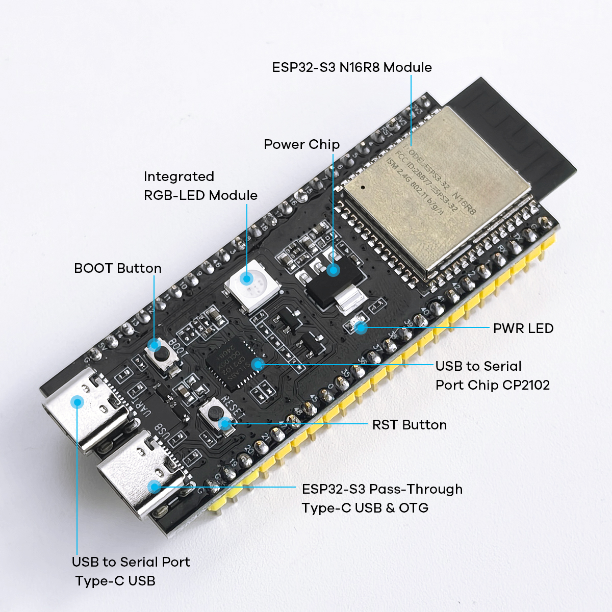

.. _hardware_intro:

Hardware Introduction
===========================

This document provides a detailed introduction to the hardware components, functions, and usage methods of the ESP32-S3 AI Chatbot.

.. _esp32s3_specs:

Main Controller - ESP32-S3
------------------------------------------

ESP32-S3 is the core processor of this project, providing powerful computing capabilities and rich interfaces.

.. figure:: img/esp32s3-1.jpg
   :align: center
   :width: 70%
   :alt: ESP32-S3 Front View

.. figure:: img/esp32s3-2.jpg
   :align: center
   :width: 70%
   :alt: ESP32-S3 Back View

**Key Features**

* Dual-core Xtensa LX7 processor with a maximum frequency of 240MHz
* Integrated Wi-Fi and Bluetooth dual-mode communication
* Rich peripheral interfaces, supporting various communication protocols
* Low power design, suitable for battery-powered applications
* Built-in neural network accelerator, supporting local AI computation

**Technical Specifications**

.. list-table::
   :widths: 30 70
   :header-rows: 0

   * - Processor
     - Dual-core Xtensa LX7, frequency up to 240MHz
   * - Memory
     - 512KB SRAM, 8MB PSRAM
   * - Storage
     - Supports up to 16MB Flash
   * - Wi-Fi
     - IEEE 802.11 b/g/n, supports 2.4GHz band
   * - Bluetooth
     - Bluetooth 5.0 and BLE
   * - GPIO
     - Up to 45 programmable GPIOs
   * - Interfaces
     - SPI, I2C, I2S, UART, USB OTG
   * - Operating Voltage
     - 3.0-3.6V
   * - Operating Temperature
     - -40°C to +85°C

.. _display_module:

Display Module
------------------------------------------

This project uses a 0.91-inch 128x32 monochrome OLED display, based on the SSD1306 controller, communicating with the ESP32-S3 via I2C interface.

.. figure:: img/oled.jpg
   :align: center
   :alt: OLED Display Module
   :width: 60%

**Key Features**

* Resolution: 128×32 pixels
* Monochrome display, high contrast
* Low power design
* Wide viewing angle, good visibility
* I2C interface, requiring only 2 GPIO pins

The display is mainly used for showing system status, message content, and interaction prompts.

.. _audio_system:

Audio System
------------------------------------------

The AI Chatbot's audio system consists of a microphone module, an amplifier module, and a speaker, supporting voice input and output functions.

**Input Section**

The project uses a high-sensitivity MEMS digital microphone INMP441, with the following features:

.. figure:: img/mic.jpg
   :align: center
   :alt: Microphone Module
   :width: 60%

* High signal-to-noise ratio, good sound pickup
* Built-in digital signal processing
* I2S interface, directly outputs digital audio signal
* Omnidirectional pickup, wide coverage

**Output Section**

The speaker system uses a digital amplifier module with an 8-ohm 3W speaker:

.. figure:: img/pa.jpg
   :align: center
   :alt: Amplifier and Speaker Module
   :width: 60%

* Clear voice playback
* Sufficient volume output
* PWM control, good sound quality

.. _buttons:

Buttons and Interaction
------------------------------------------

The device provides physical buttons for simple operations and control:

* Reset button: For system restart
* Function buttons: Customizable functions, default for wake-up/pause

**Operation Guide**

1. The one connected to GPIO40 is Volume+
2. The one connected to GPIO39 is Volume- (long press for mute)
3. The one connected to GPIO0 is for waking up or interrupting

.. _hardware_connection:

Hardware Connection Diagram
------------------------------------------

The following diagram shows how each hardware module is connected:

