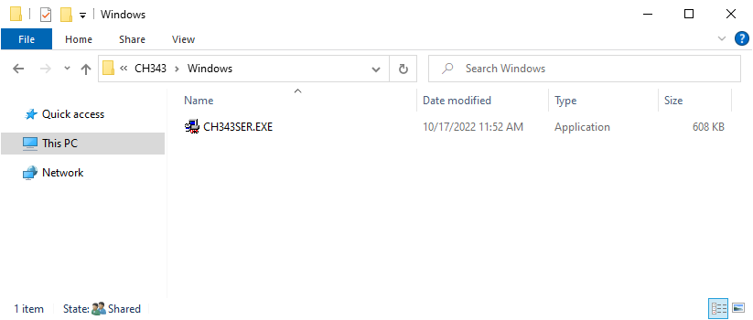
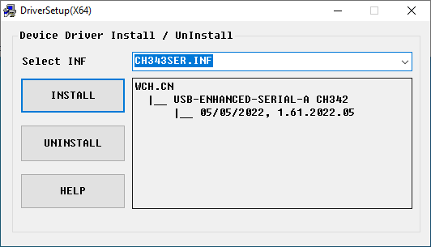
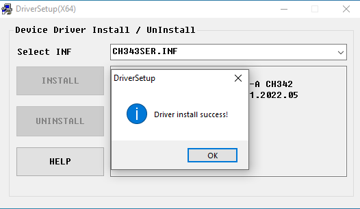
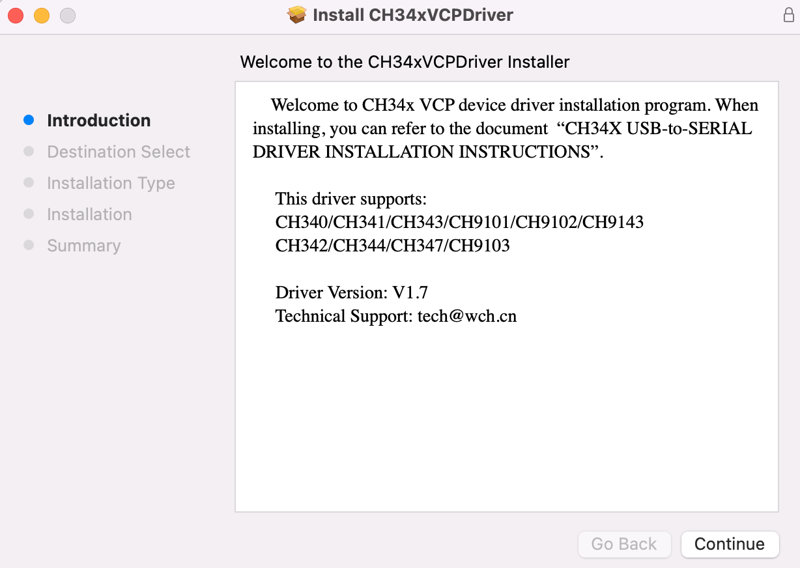
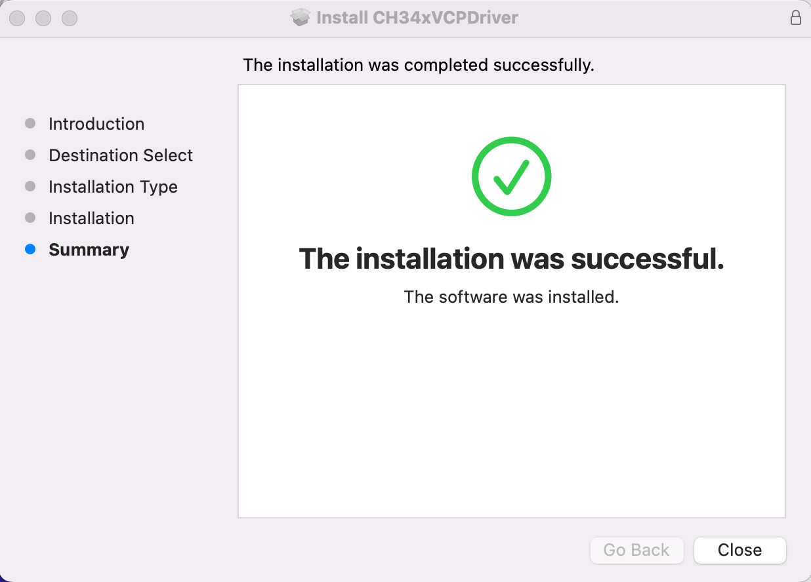

.. _install_driver:

Driver Installation
=========================

Installing the CH343 Driver
------------------------------------------

Windows
^^^^^^^^^^^^^^^^^^^^^^^^^^^^^^^^^^^^^^^^^^

**Check Whether CH343 Has Been Installed**

ESP32-S3 uses CH343 to download codes. Before using it, we need to install the CH343 driver on our computers.

1. Connect your computer and ESP32-S3 with a USB cable (connect to the port indicated by the red arrow)

.. figure:: img/esp32s3.png
   :align: center

2. Turn to the main interface of your computer, select "This PC" and right-click to select "Manage".

.. figure:: img/driver_5.png
   :align: center

3. Click "Device Manager". If your computer has installed CH343, you can see "USB-Enhances-SERIAL CH343 (COMx)". You can then proceed to the next step.

.. figure:: img/driver_6.png
   :align: center

**Installing CH343**

1. First, download the CH343 driver. Click `HERE <http://www.wch-ic.com/search?t=all&q=ch343>`_ to download the appropriate one based on your operating system. 

.. figure:: img/driver_7.png
   :align: center

If you do not want to download the installation package from the website, you can open "AIChatBot/CH343", as we have prepared the installation package.

.. figure:: img/driver_8.png
   :align: center

2. Open the folder "AIChatBot/CH343/Windows/".

3. Double click "CH343SER.EXE".

4. Click "INSTALL" and wait for the installation to complete.

.. figure:: img/driver_11.png
   :align: center

5. Installation successful. Close all interfaces.

6. When ESP32-S3 is connected to the computer, select "This PC", right-click to select "Manage" and click "Device Manager" in the newly pop-up dialog box, and you can see the following interface.

.. figure:: img/driver_6.png
   :align: center

7. So far, CH343 has been installed successfully. Close all dialog boxes.

MacOS
^^^^^^^^^^^^^^^^^^^^^^^^^^^^^^^^^^^^^^^^^^

1. First, download the CH343 driver. Click `HERE <http://www.wch-ic.com/search?t=all&q=ch343>`_ to download the appropriate one based on your operating system. 

.. figure:: img/driver_7.png
   :align: center

2. If you do not want to download the installation package from the website, you can open "AIChatBot/CH343", as we have prepared the installation package. Open the folder "AIChatBot/CH343/MAC/".

.. figure:: img/driver_13.png
   :align: center

3. Click "Continue".

4. Click "Install".

.. figure:: img/driver_15.png
   :align: center

5. Wait for the installation to finish.

.. figure:: img/driver_16.png
   :align: center

6. Finally, restart your computer.

If you still haven't installed the CH343 by following the steps above, you can view readme.pdf for additional installation instructions.

.. figure:: img/driver_18.png
   :align: center

System Requirements
^^^^^^^^^^^^^^^^^^^^^^^^^^^^^^^^^^^^^^^^^^

* Windows - Win 10 and newer, 64 bits
* Linux - 64 bits
* Mac OS Intel - Version 10.14: "Mojave" or newer, 64 bits
* Mac OS Apple Silicon - Version 11: "Big Sur" or newer, 64 bits