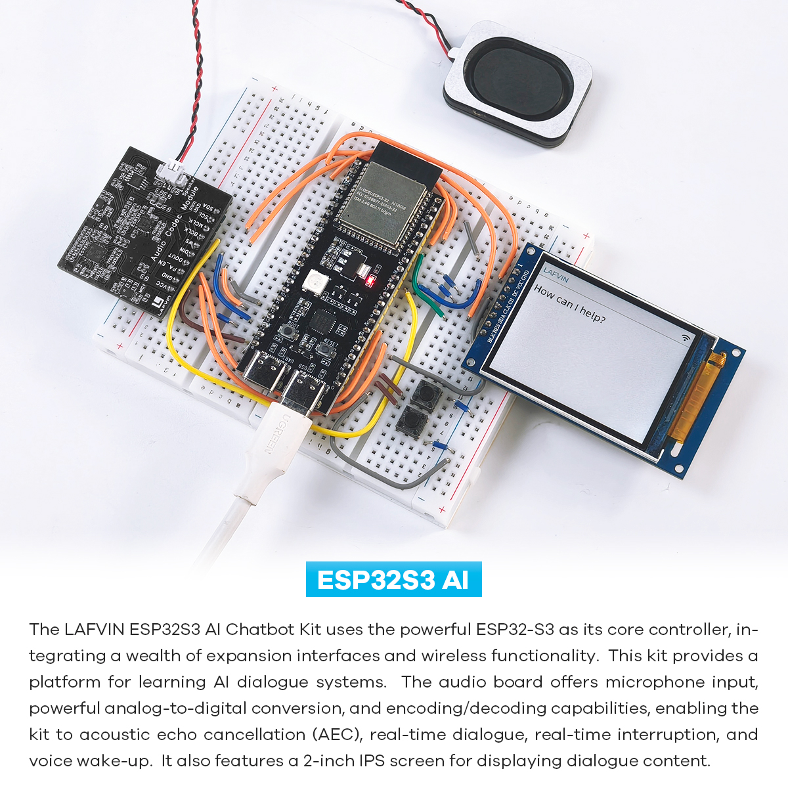

.. _introduction:

简介
================

项目概述
------------------------

ESP32S3 AI聊天机器人是一个基于ESP32S3微控制器的智能语音交互项目。该项目集成了LAFVIN Al Chatbot Shield 、LAFVIN Audio Codec Module 、2.0寸TFT-SPI屏幕以及按钮等硬件模块，打造了一个能够与用户进行自然语言对话的智能助手。

本项目结合了边缘计算和云端AI能力，提供流畅的语音交互体验，适用于智能家居控制、个人助理、教育陪伴、娱乐互动等多种场景。

项目内有两套不同的AI方案，你可以根据需要来选择对应的进行烧录使用

.. 本项目基于 `xiaozhi-esp32 <https://github.com/78/xiaozhi-esp32/blob/main/README_en.md>`_。如果您想添加自己的功能，可以按照文档进行二次开发。

应用场景
----------------------

* **智能家居助手**：控制智能设备、查询天气等
* **学习伙伴**：回答问题、提供学习资源、知识问答
* **娱乐互动**：讲故事、玩游戏、提供音乐推荐
* **开发平台**：测试和开发AI应用、语音交互原型设计
* **物联网节点**：作为交互界面集成到更大的智能系统中

.. _features:

主要特点
--------------------------------
* **多种唤醒方式**：
   * 离线语音唤醒（ESP-SR）
   * 支持自定义唤醒词

* **多语言支持**：
   * 英语
   * 中文（普通话、粤语）
   * 日语
   * 韩语
   * 其他语言（西班牙语、法语、德语等）

* **语音交互**：
   * 通过麦克风捕获用户语音
   * 高质量语音合成播放
   * 支持多种语音音色
   * 实时语音对话流

* **个性化**：
   * 可配置的提示系统
   * 自定义角色设置
   * 多种语音音色选项
   * 个性化对话风格

* **OLED显示**：
   * 实时设备状态显示
   * 滚动对话内容
   * 系统信息显示

* **智能对话**：
   * 连接云端AI大语言模型
   * 上下文理解支持
   * 知识问答和任务执行
   * 自然对话交互

* **可扩展性**：
   * 开放的硬件和软件架构
   * 支持自定义功能扩展
   * 丰富的二次开发接口
   * 支持多种硬件平台

.. _tech_specs:

技术规格
--------------------------------

* 核心控制器：ESP32S3
* 语音输入/输出: LAFVIN Audio Codec Module
* 显示界面：2.0寸TFT-SPI屏幕
* 交互方式：语音识别
* 电源供应：USB供电
* 连接方式：Wi-Fi、蓝牙
* 支持语言：多语言支持 