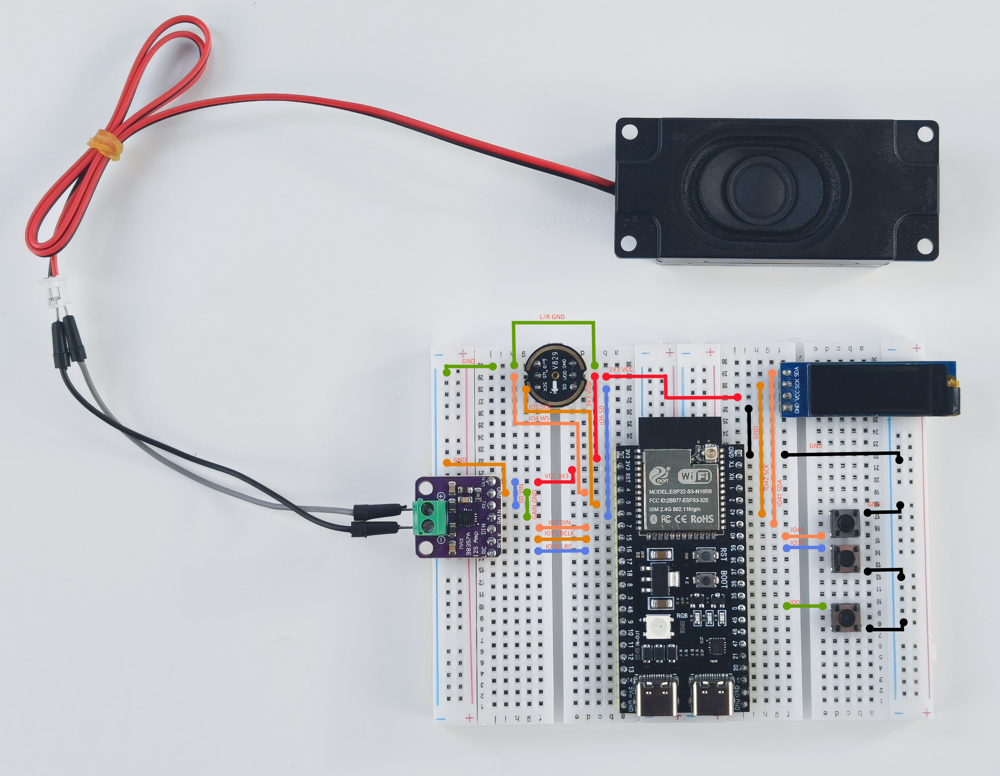

.. _hardware_connect:

硬件连接
======================

硬件清单
----------------------

.. list-table::
   :widths: 30 70
   :header-rows: 1

   * - 组件
     - 描述
   * - ESP32S3模块 (×1)
     - 核心微控制器，负责处理网络连接 、 语音识别、AI对话和其他核心功能
   * - 400 Tie-Points Breadboard (×2)
     - 组装各种硬件模块的基本平台
   * - LAFVIN Al Chatbot Shield (×1)
     - 不用接线就能完成AIChatBot的组装
   * - LAFVIN Audio Codec Module (×1)
     - 语音输入/输出
   * - 2.0寸TFT-SPI屏幕
     - 显示设备状态和对话内容
   * - 跳线
     - 连接各种模块
   * - 按钮
     - 文本翻页
   * - USB数据线
     - 提供电源和数据传输

连接图
----------------------

完成的连接应如上图所示

.. warning:: 
  请务必按照上面的连接图连接模块，否则模块可能会损坏。

连接说明
-------------------------

如果你要使用面包板进行接线,ESP32S3模块与其他组件的连接方法如下：

**LAFVIN Audio Codec Module连接**

* VCC - 5V
* GND - GND
* PA_EN - GPIO48
* DOUT - GPIO45
* DIN - GPIO12
* WS - GPIO13
* BCLK - GPI14
* MCLK - GPIO38
* SCL - GPIO12
* SDA - GPIO1

**2.0寸TFT-SPI屏幕连接**

* GND - GND
* VCC - 3V3
* DC - 39
* CS - 47
* CLK - 41
* SDA - 40
* RES - RST
* BLK - 42

**按钮连接**

* 向上翻页 - GPIO20
* 向下翻页 - GPIO19

组装步骤
----------------------

1. 将模块插入扩展板对应的接口
2. 按照扩展板的描述安装对应的模块
3. 如果使用面包板,检查所有连接是否牢固，避免虚连接
