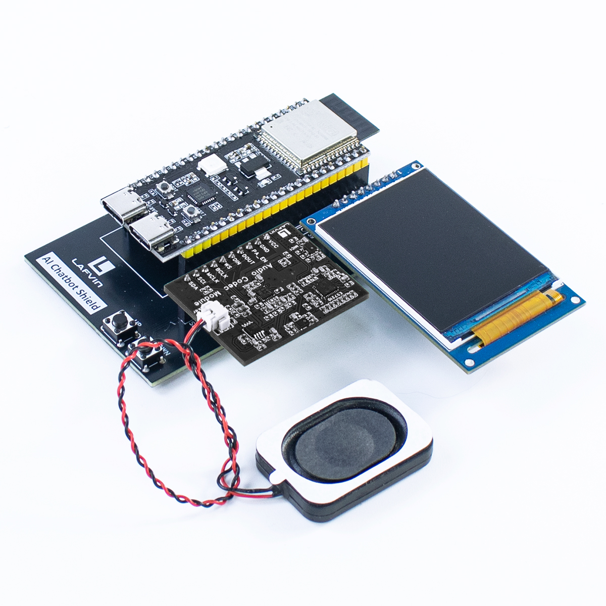

.. _hardware_connect:

Hardware Connection
======================

Hardware List
----------------------

.. list-table::
   :widths: 30 70
   :header-rows: 1

   * - Component
     - Description
   * - ESP32S3 Module (×1)
     - Core microcontroller with integrated Wi-Fi/Bluetooth functionality, responsible for voice recognition, AI dialogue processing, and system control
   * - 400 Tie-Points Breadboard (×2)
     - Solderless platform for quick electronic component connections
   * - LAFVIN AI Chatbot Shield (×1)
     - Specialized expansion board that simplifies wiring, providing a plug-and-play solution for AIChatBot functionality
   * - LAFVIN Audio Codec Module and Speaker (×1)
     - High-quality audio codec for processing voice input capture and audio output synthesis
   * - 2.0-inch TFT-SPI Display
     - High-definition color display interface for real-time conversation content and system status information
   * - Jumper Wires
     - Electrical connection wires between modules, ensuring proper signal and power transmission
   * - Buttons (x4)
     - Physical interaction for text page navigation
   * - USB Data Cable
     - Provides stable power input and data communication between computer and device

Connection Instructions
-------------------------

If you are using the expansion board for wiring, the connection method between the ESP32S3 module and other components is as follows:

The completed connection with the expansion board should look like the image above

If you are using a breadboard for wiring, the connection method between the ESP32S3 module and other components is as follows:

**LAFVIN Audio Codec Module Connection**

* VCC - 5V
* GND - GND
* PA_EN - GPIO48
* DOUT - GPIO45
* DIN - GPIO12
* WS - GPIO13
* BCLK - GPI14
* MCLK - GPIO38
* SCL - GPIO12
* SDA - GPIO1

**2.0-inch TFT-SPI Screen Connection**

* GND - GND
* VCC - 3V3
* DC - 39
* CS - 47
* CLK - 41
* SDA - 40
* RES - RST
* BLK - 42

**Button Connection**

* Page Up - GPIO20
* Page Down - GPIO19

.. image:: img/connect.png

.. warning:: 
  Be sure to connect the modules according to the connection diagram above, otherwise the modules may be damaged.

Assembly Steps
----------------------

1. Insert the modules into the corresponding interfaces on the expansion board
2. Install the corresponding modules according to the description on the expansion board
3. If using a breadboard, check that all connections are secure and avoid false connections
