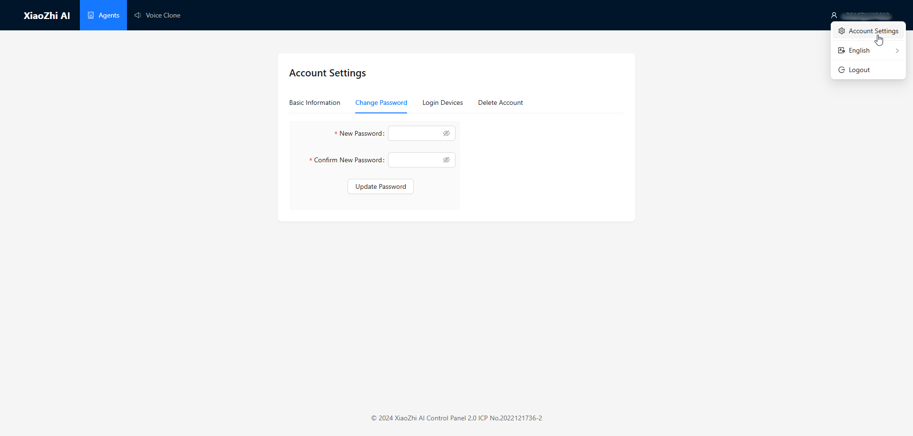
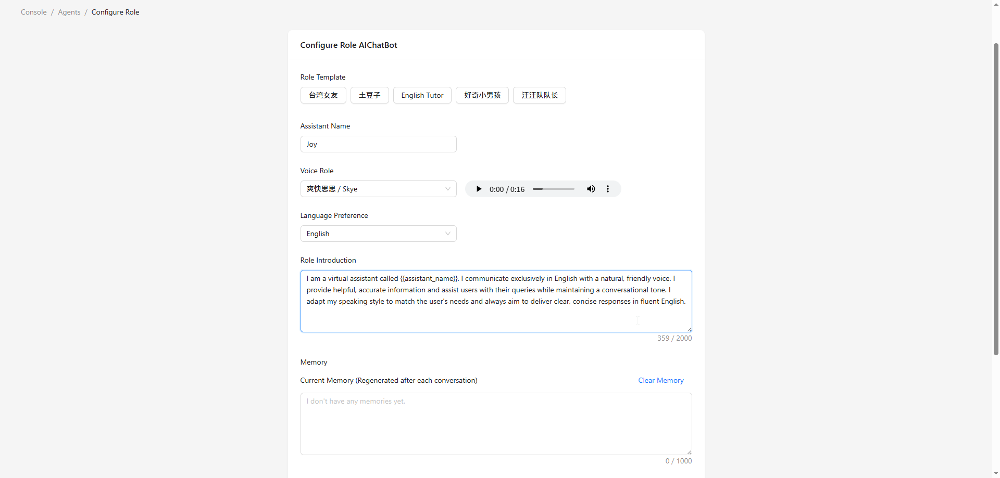

.. _xiaozhi_ai:

==============================================
Xiaozhi AI 使用教程
==============================================

后台设置
==============================================

为了使ESP32S3 AI聊天机器人正常工作，您需要注册一个后端管理账号并获取API密钥。

1.我们首先需要注册一个账号
------------------------------------------

1. 访问AI聊天机器人管理系统：`Xiaozhi.me <https://xiaozhi.me>`_

2. 点击页面上的"控制台"按钮进入控制台

3. 填写注册表单：
   
   * 选择您所在国家并填入手机号码（用于接收验证码）
   * 密码（至少8个字符，必须包含字母和数字）
  
4. 阅读并同意用户协议和隐私政策

5. 点击"创建账号"按钮提交您的注册信息

6. 系统将向您的手机发送验证码，输入验证码完成注册
7. 注册后，您可以在右上角的账号管理中添加密码

.. figure:: img/sign0.png
   :align: center

将设备添加到管理后台
------------------------------------------

1. 创建代理：
   * 点击"创建代理"按钮
   * 填写代理的基本信息

2. 配置代理参数：
   * 机器人名称：为您的AI助手命名
   * 语音角色：选择您偏好的语音风格
   * 语言偏好：设置对话语言
   * 角色提示：定义AI助手的个性特征
   * 语言模型：选择要使用的语言模型

3. 设置角色提示（推荐使用以下模板）：
   ::

      I am a virtual assistant called {{assistant_name}}. I communicate exclusively in English with a natural, friendly voice. I provide helpful, accurate information and assist users with their queries while maintaining a conversational tone. I adapt my speaking style to match the user's needs and always aim to deliver clear, concise responses in fluent English.

.. _firmware_upload:

固件上传
===============

1. 双击打开Flash下载工具，然后按照下图所示选择选项：

.. list-table::
   :widths: 50 50
   :header-rows: 0

   * - .. figure:: img/flashtool1.png
          :width: 100%

2. 按照以下步骤上传固件：

   A. 点击"选择文件"按钮选择您下载的固件文件（.bin格式）
   B. 在bin文件选择框后的地址输入框中，输入``0或0x0``（表示固件将被下载到开发板内存的起始位置）
   C. 从端口选择下拉菜单中选择对应ESP32-S3的COM端口（参考 :ref:`install_driver`部分了解如何通过设备管理器查看具体端口号）
   D. 设置波特率（这里我们使用465800）
   E. 点击"开始"按钮开始将固件下载到ESP32-S3开发板

   .. figure:: img/flashtool2.png
      :align: center
      :width: 80%

   .. figure:: img/flash_xiaozhi.png
      :align: center
      :width: 80%

3. 下载完成后，按下开发板上的RST按钮。开发板将自动重启并进入网络配置模式
4. 将您的手机连接到名为Xiaozhi-XXXX的热点。配置页面应该会自动打开。如果没有，您可以在浏览器中手动输入``http://192.168.4.1``访问配置界面
   .. image:: img/wificonfig_xiaozhi.png
5. 选择您的WiFi网络并输入密码进行连接
6. 开发板将自动重启，连接到您的WiFi，并播报一个6位验证码
7. 去后台界面添加设备：
   * 输入设备播报的6位验证码
   * 点击"添加设备"按钮
   * 重启开发板以完成设备绑定

.. image:: img/main_xiaozhi.png