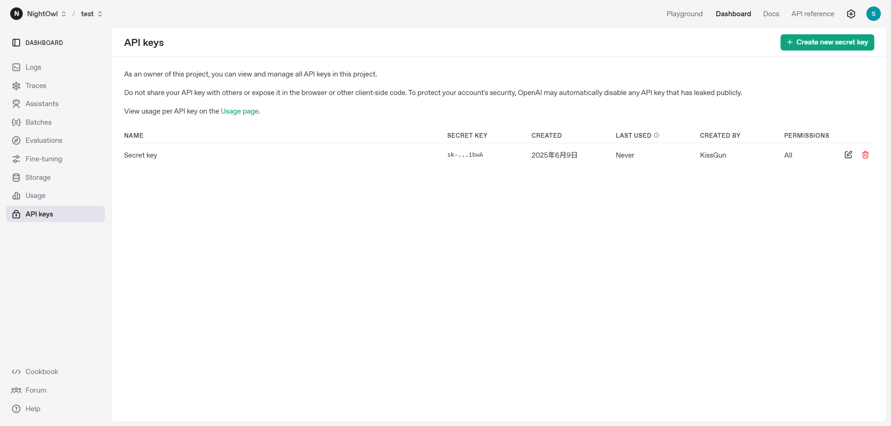
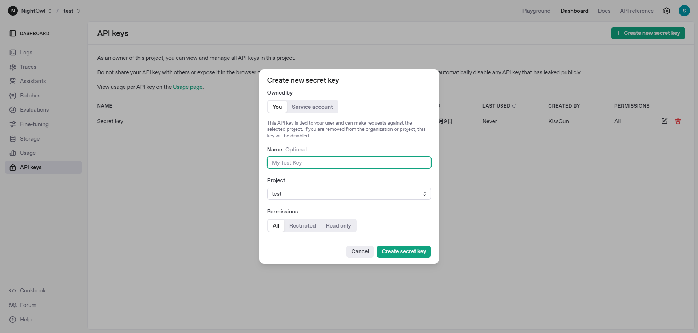
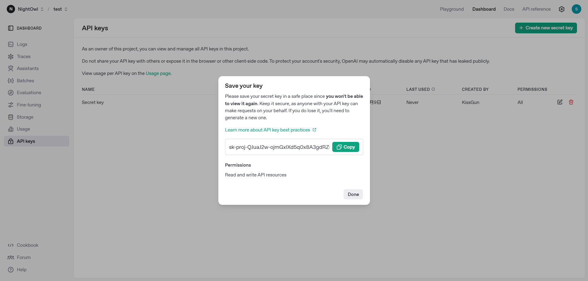
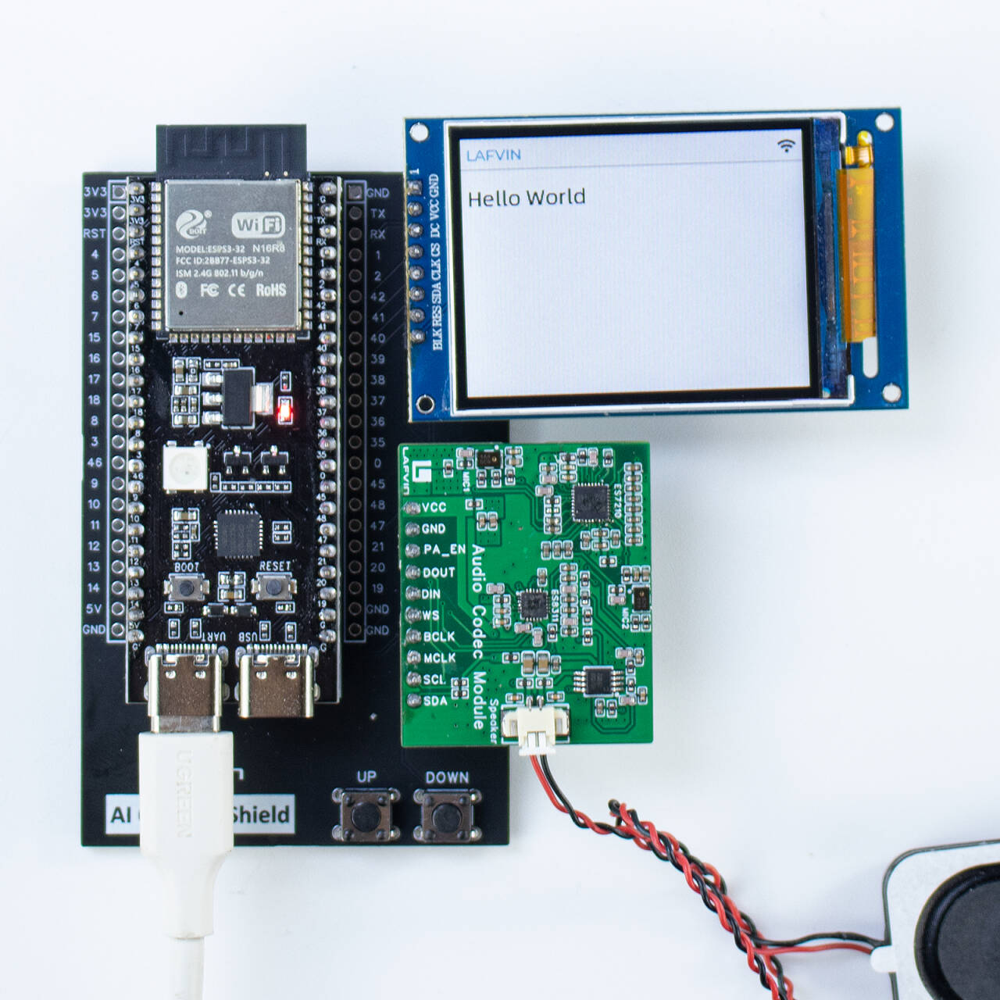

.. _chatgpt:

==============================================
ChatGPT 使用教程
==============================================

后台设置
==============================================

为了使ESP32S3 AI聊天机器人正常工作，您需要注册一个openai平台账号并且获取apikey 

注意:This project requires the use of OpenAI API, and you need to pay for OpenAI. Additionally, the OpenAI API is billed separately from ChatGPT, with its own pricing available at https://openai.com/api/pricing/.

Therefore, you need to decide whether to continue with this project or ensure you have funded the OpenAI API.

1.获取Openai apikey
------------------------------------------

1. 首先访问 https://platform.openai.com/api-keys ,然后点击Create new secret key按钮

2. Select the Owner, Name, Project, and permissions as needed, and then click Create secret key.

3. 生成之后,复制这个apikey然后保存在安全的可访问的地方,由于安全原因,关闭这个页面之后,这个apikey将无法再次查看复制

.. _OAI_firmware_upload:

固件上传
===============

1. 双击打开Flash下载工具，然后按照下图所示选择选项：

.. list-table::
   :widths: 50 50
   :header-rows: 0

   * - .. figure:: img/flashtool1.png
          :width: 100%

1. 按照以下步骤上传固件：

   A. 点击"选择文件"按钮选择您下载的固件文件（.bin格式）
   B. 在bin文件选择框后的地址输入框中，输入``0或0x0``（表示固件将被下载到开发板内存的起始位置）
   C. 从端口选择下拉菜单中选择对应ESP32-S3的COM端口（参考 :ref:`install_driver`部分了解如何通过设备管理器查看具体端口号）
   D. 设置波特率（这里我们使用465800）
   E. 点击"开始"按钮开始将固件下载到ESP32-S3开发板

   .. figure:: img/flashtool2.png
      :align: center
      :width: 80%

   .. figure:: img/flash_gpt.png
      :align: center
      :width: 80%

2. 下载完成后，按下开发板上的RST按钮。开发板将自动重启并进入网络配置模式并在屏幕显示配置AP和密码
   .. image:: img/wificonfig_gpt.png
3. 将您的手机连接到名为ESP32_Config的热点。您可以在浏览器中手动输入``http://192.168.4.1``访问配置界面
4. 选择您的WiFi网络并输入密码并填写APIkey(这里的网络需要可以正常连接到openai的服务器)
5. 开发板将自动重启，连接到您的WiFi,并自动连接AI服务(如果超过30s没有重启可以重新按下RST键)

