.. _chatgpt:

==============================================
5.ChatGPT Tutorial
==============================================

Backend Setup
==============================================

To make the LAFVIN ESP32S3 AIChatBot work properly, you need to register an OpenAI platform account and obtain an API key.

.. warning::
   This project uses the OpenAI API, which is billed separately from ChatGPT subscriptions. You need an OpenAI account with paid API balance before you can create and use an API key. Pricing information is available at https://openai.com/api/pricing/.

Model Used in This Project
------------------------------------------

This project uses the ``gpt-realtime-mini`` model.

At the time of writing, the official pricing for this model is:

* Input: ``$0.60`` per 1M tokens
* Output: ``$2.40`` per 1M tokens
* Cached input: ``$0.06`` per 1M tokens

For the latest model details and pricing, see the official OpenAI model page:
`gpt-realtime-mini <https://developers.openai.com/api/docs/models/gpt-realtime-mini>`_

1. Obtaining OpenAI API Key
------------------------------------------

1. First, visit https://platform.openai.com/api-keys, then click the Create new secret key button

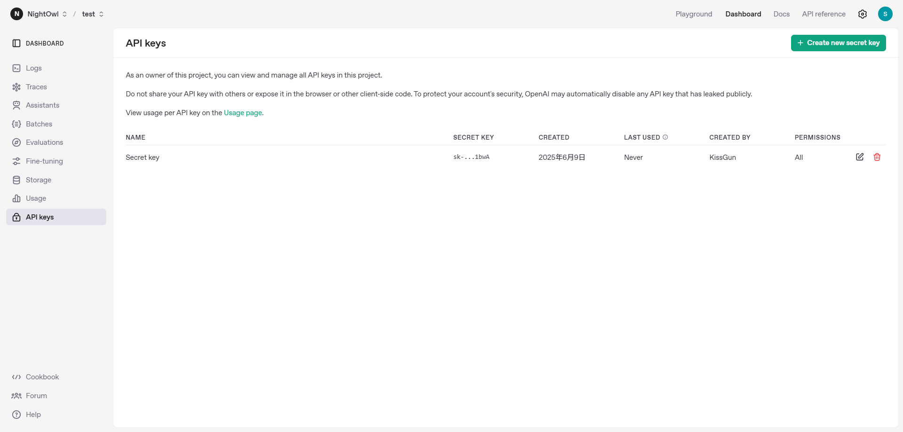

2. Select the Owner, Name, Project, and permissions as needed, and then click Create secret key.

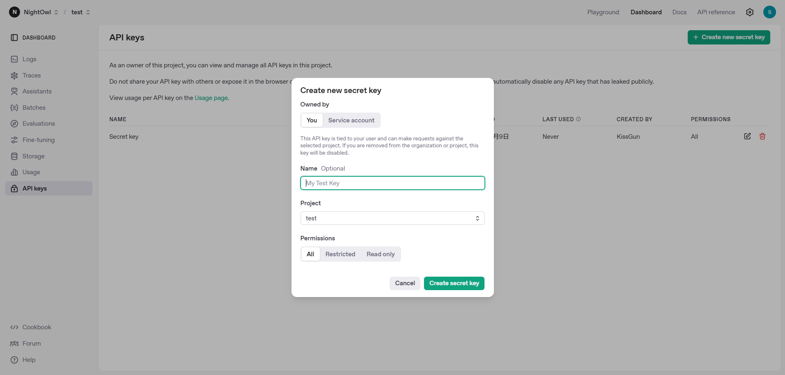

3. After generation, copy this API key and save it in a secure and accessible place. For security reasons, you will not be able to view or copy this API key again after closing this page.

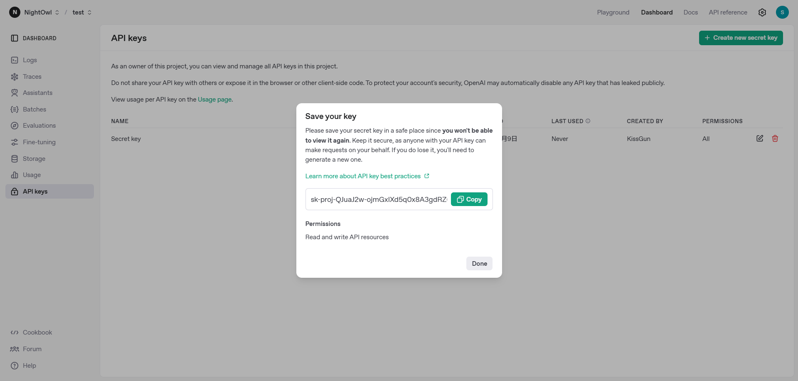

.. _chatgpt_firmware_upload:

Firmware Upload
===============

Online Flashing (Recommended)
-----------------------------

The recommended method is to use the LAFVIN Web Flasher. It runs directly in Chrome or Edge and does not require you to install a separate flashing tool.

.. note::
   Online flashing is supported only in Chrome or Edge browsers.

.. warning::
   Use a USB Type-C cable that supports data transfer. A charging-only cable may power the board but will not work for flashing.

For detailed instructions on using the online flasher, see :ref:`Online Flasher <online_flasher>`.

1. Open the `LAFVIN Web Flasher <https://lafvintech.github.io/Lafvin_Web_Flasher/>`_.
2. Select your device model. For this kit, choose ``ESP32S3 AI Chatbot Kit``.

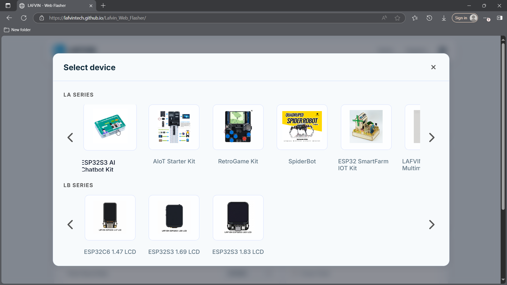

3. Select the ChatGPT firmware and the firmware version you want to flash.

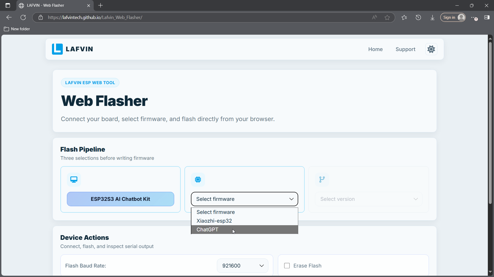

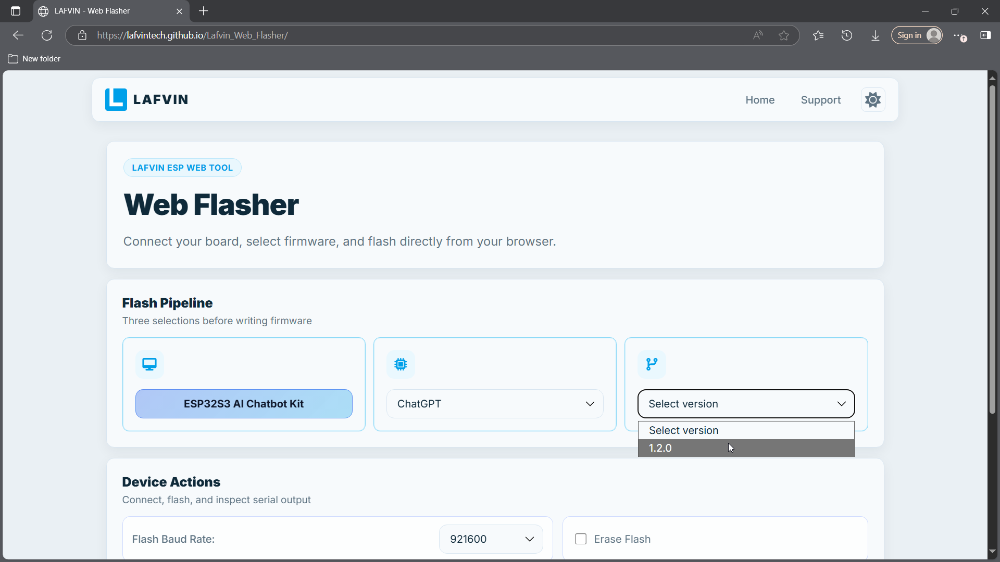

4. Connect the development board to your computer using a UART Type-C data cable. Use the Type-C port on the left side of the board.
5. Click ``Connect``, select the serial port for your ESP32-S3 device in the browser pop-up window, and confirm the connection.

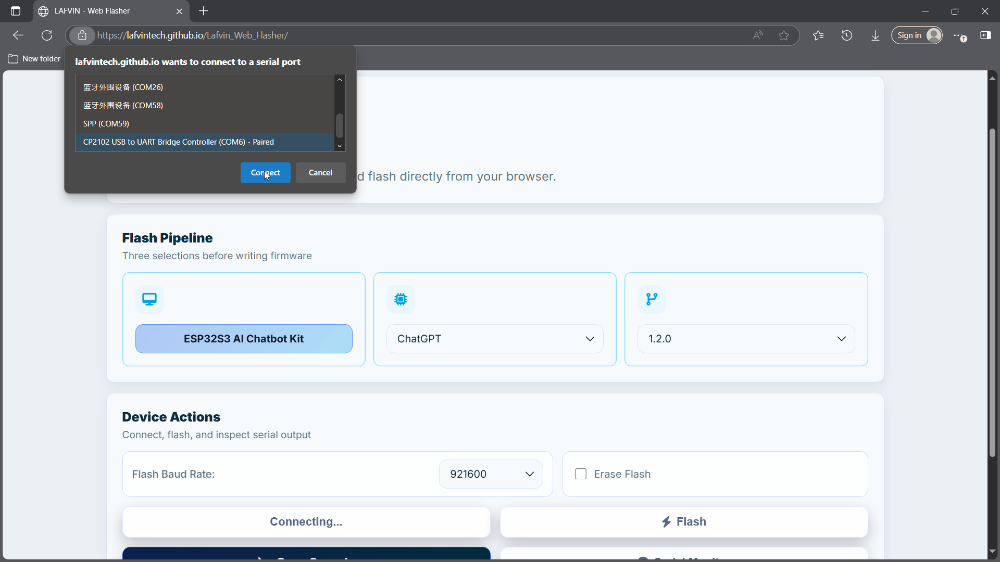

6. Click ``Flash`` and wait for the flashing process to complete.

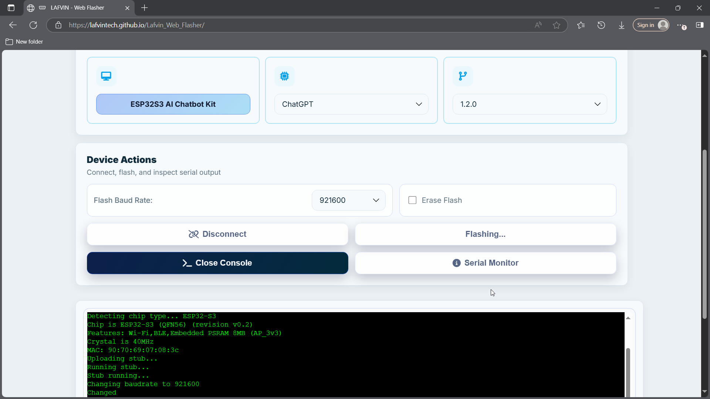

7. After flashing is complete, restart the development board.

.. note::
   If this is your first time flashing the device, enable ``Erase Flash`` in the web flasher before clicking ``Flash``.

.. note::
   When using online flashing on macOS, connect the USB Type-C cable to the ESP32-S3 ``USB`` port instead of the ``UART`` port. Then press and hold ``BOOT``, press ``RESET`` while still holding ``BOOT``, and enter download mode before starting the flash process.

.. raw:: html

   

   
<strong>Local Flashing (Alternative)</strong>

If you cannot use the web flasher, you can use Espressif Flash Download Tools as an alternative.

1. Double-click to open Flash Download Tools, then select the options as shown below:

.. list-table::
   :widths: 50
   :header-rows: 0

   * - .. figure:: img/flashtool1.png
          :width: 100%

2. Follow these steps to upload the firmware:

   A. Click the "Select File" button to choose your downloaded firmware file (.bin format)
   B. In the address input box after the bin file selection box, enter ``0 or 0x0`` (indicating that the firmware will be downloaded to the starting position of the development board's memory)
   C. Select the COM port corresponding to ESP32-S3 from the port selection dropdown menu (refer to the :ref:`install_driver` section for how to check the device manager for the specific port number)
   D. Set the baud rate (we use 460800 here)
   E. Click the "START" button to begin downloading the firmware to the ESP32-S3 development board

   .. figure:: img/flash_chatgpt1.png
      :align: center
      :width: 80%

   .. figure:: img/flash_chatgpt2.png
      :align: center
      :width: 80%

.. raw:: html

   

.. _chatgpt_conf:

Network and API Configuration
=============================

.. note::
   The ESP32-S3 supports only 2.4 GHz Wi-Fi networks. In addition, the Wi-Fi network you choose must be able to access OpenAI's servers.

After the firmware is flashed, press the RST button on the development board. The board will automatically restart and enter network configuration mode, displaying the configuration AP and password on the screen.

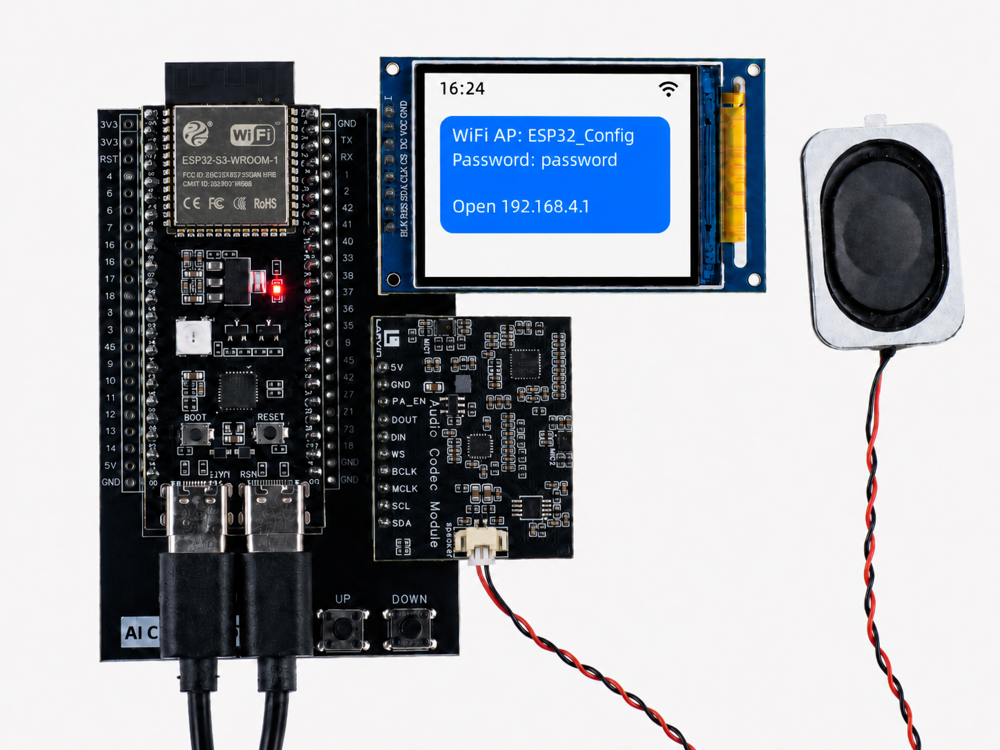

1. Connect your phone to the hotspot named ESP32_Config. You can manually enter ``http://192.168.4.1`` in your browser to access the configuration interface.

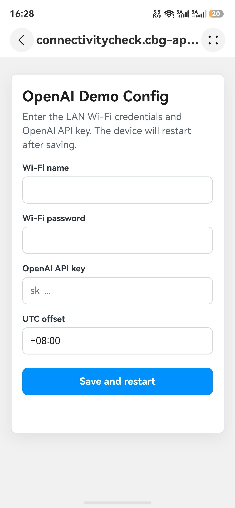

2. Select your Wi-Fi network, enter the password, and fill in the API key. The network you use must be able to access OpenAI's servers.
3. The development board will automatically restart, connect to your Wi-Fi, and connect to the AI service. If it does not restart after 30 seconds, press the RST button again.

Common Setup Issues
-------------------

If the device cannot complete the setup successfully, check the following common issues.

API Key Error
^^^^^^^^^^^^^

If the API key is invalid, missing, or entered incorrectly, the device will display an API key error message on the screen.

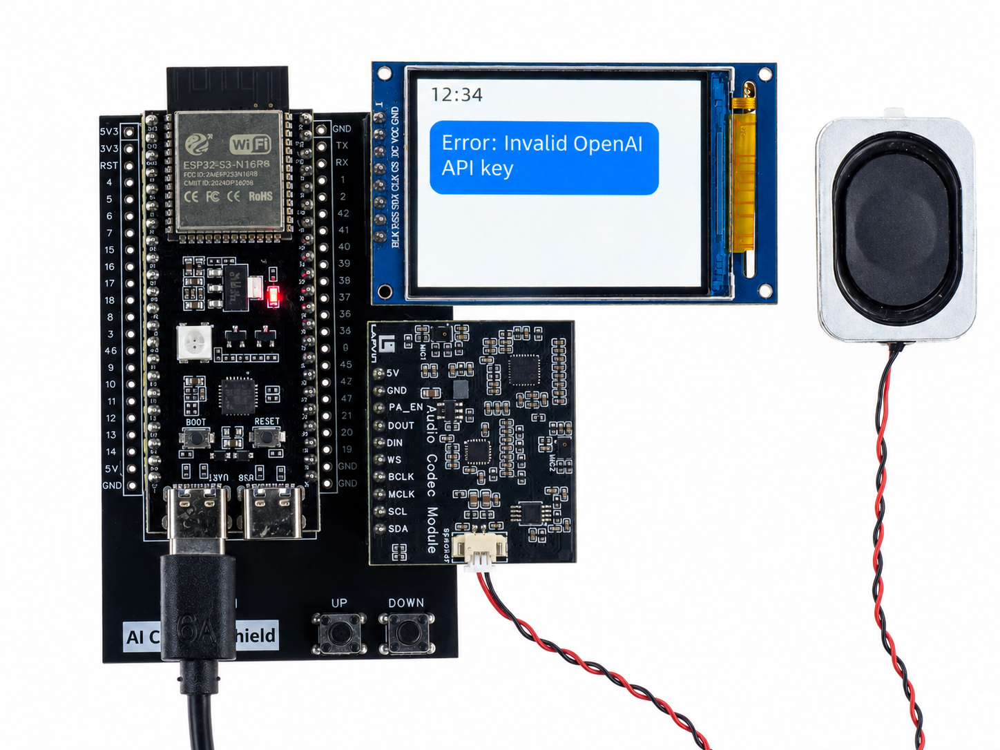

Please check the following:

1. Make sure the API key was copied completely.
2. Make sure there are no extra spaces before or after the API key.
3. Make sure the API key is still valid and has not been deleted.

Cannot Connect to OpenAI
^^^^^^^^^^^^^^^^^^^^^^^^

If the Wi-Fi network cannot reach OpenAI's servers, the device will display a network connection error on the screen.

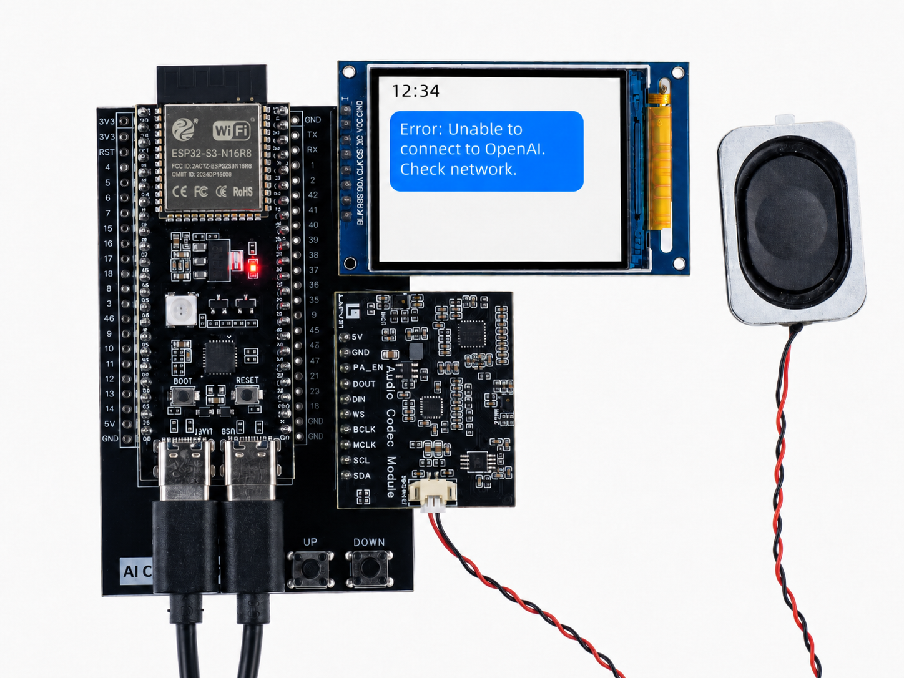

Please check the following:

1. Make sure your Wi-Fi network can access OpenAI's servers.
2. Try another Wi-Fi network if the current one blocks or restricts access.
3. Restart the device after confirming that the network is working properly.

Re-enter AP Configuration Mode
^^^^^^^^^^^^^^^^^^^^^^^^^^^^^^

If the Wi-Fi settings or API key are entered incorrectly, you can use the following steps to enter AP configuration mode again:

1. Open the online flasher and connect to the device by following the steps above.
2. After the connection is successful, click ``Serial Monitor``.
3. Enter ``reset_config`` in the input box.
4. After the command is sent, the device will restart and re-enter AP configuration mode.

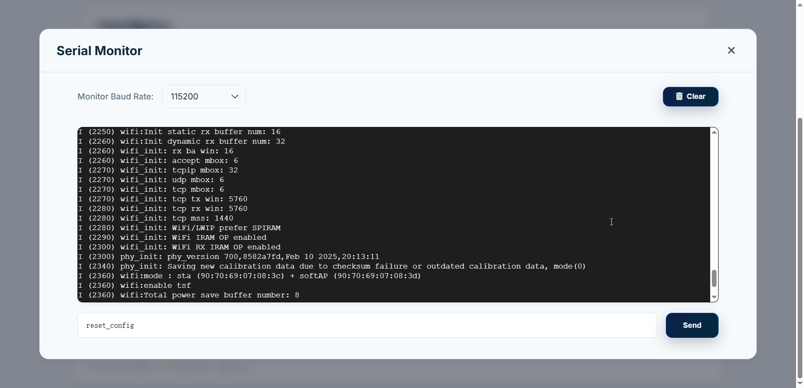

Tip:
If you want to adjust the volume, double-click the ``UP`` or ``DOWN`` button at the bottom of the expansion board. The volume will increase or decrease in 10% steps, and the change will be shown on the display.

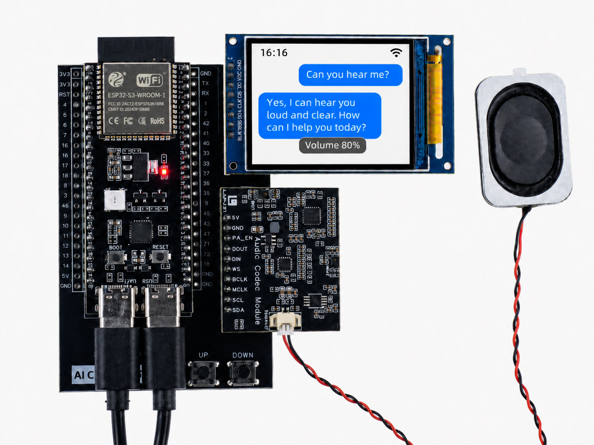

At this point, the basic configuration of the ChatGPT firmware is complete. You can now start talking with the device and experience the intelligent interaction powered by ChatGPT.

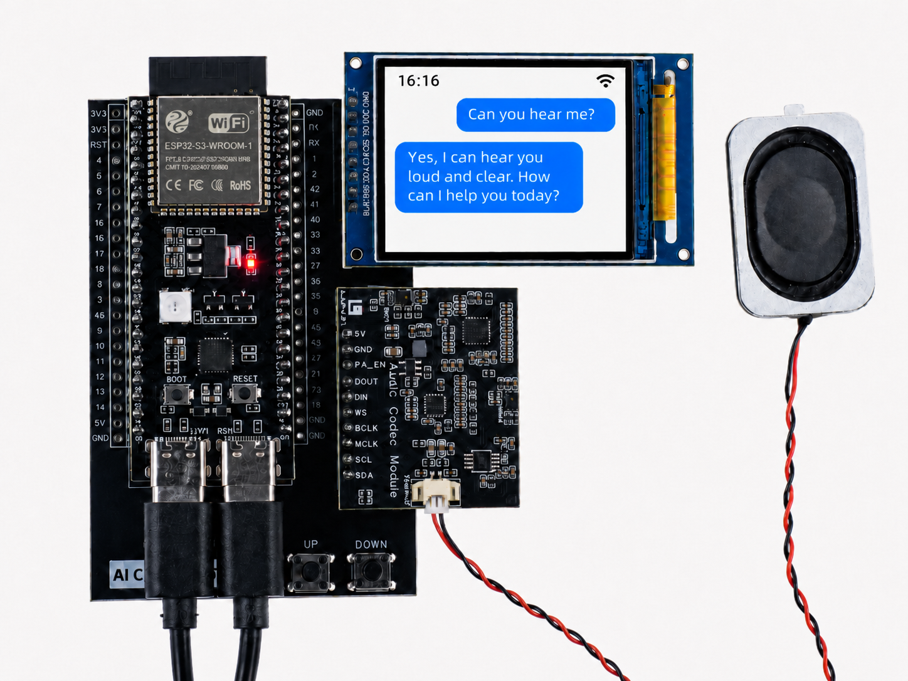

If you are using a macOS system, please refer to the firmware upload method described in :ref:`macos_upload`.
