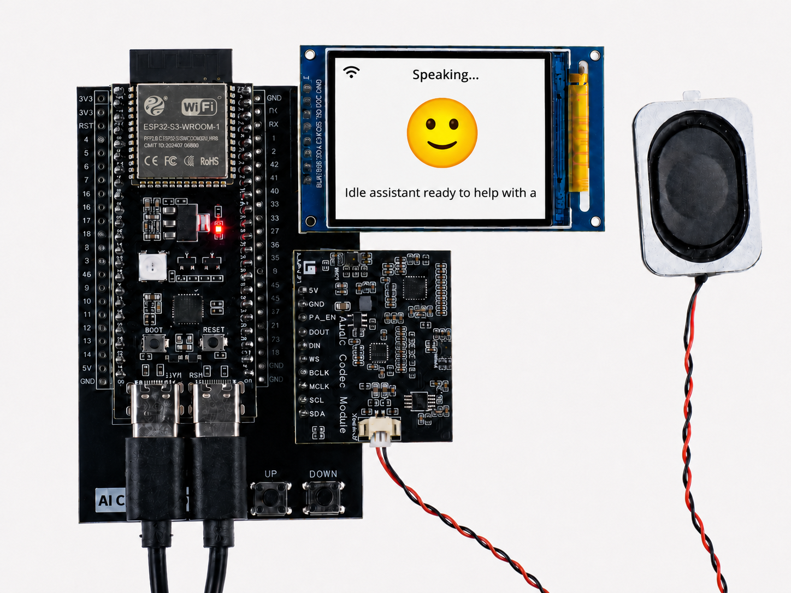

.. _features_usage:

Usage Guide
=============

This section introduces the main features and everyday usage of the LAFVIN ESP32S3 AIChatBot.

Voice Interaction
------------------------------------------

The core experience of the LAFVIN ESP32S3 AIChatBot is voice interaction. You can talk to the device in the following ways:

**Wake-up Methods**

1. Wake word trigger:

   * The default wake words are ``Hi, ESP`` and ``Sophia``.
   * If you want a different wake word, you can customize it through secondary development.
   * After the wake word is detected, the AI ChatBot will respond and enter listening mode.
   * After wake-up, there is a listening window of about 5 seconds for your question or command.
   * The ChatGPT firmware supports direct conversation without a wake word, and both firmware versions support interruption during conversation.

**Conversation Capabilities**

The LAFVIN ESP32S3 AIChatBot can handle a variety of conversations, including:

1. General Q&A for everyday questions and common knowledge
2. Information requests such as weather, time, and current events
3. Entertainment interactions such as jokes, stories, and riddles
4. Personalized responses based on your selected role and prompt settings

**Voice Quality**

1. Microphone pickup range: approximately 2 to 3 meters
2. Noise suppression: built-in processing helps reduce background noise

LCD Display Functions
------------------------------------------

The LAFVIN ESP32S3 AIChatBot includes a 2-inch LCD screen for status display and conversation feedback.

**Basic Interface**

1. Standby interface:

   * Displays the current time
   * Shows the device status, including network status indicators

2. Interactive interface:

   * Displays a listening animation while the device is waiting for speech
   * Shows recognized speech text in real time
   * Scrolls the AI response on the screen

.. image:: img/gpt_chat.png

**Information Display**

1. System information:

   * Wi-Fi connection status
   * AI service connection status

Button Operations (ChatGPT Version)
------------------------------------------

On the ChatGPT firmware, the physical buttons on the device support the following actions:

1. Single-click ``UP``: scroll the conversation upward
2. Single-click ``DOWN``: scroll the conversation downward
3. Double-click ``UP``: increase the volume
4. Double-click ``DOWN``: decrease the volume

Use Cases
------------------------------------------

The LAFVIN ESP32S3 AIChatBot can fit naturally into a range of everyday situations.

**Daily Convenience**

1. Start your morning with a quick question such as: ``What's the weather like today?``
2. Ask for local information before a trip, for example: ``Tell me about Los Angeles.``
3. Use it for quick factual questions throughout the day, such as: ``Why do sloths move so slowly?``

**Learning and Study**

1. Ask for explanations of school topics, for example: ``What is the process of photosynthesis?``
2. Use it for language help, such as: ``How do you say 'innovation' in Chinese?``
3. Let it solve quick calculations, for example: ``What is 23 multiplied by 45?``

**Fun and Conversation**

1. Ask it to tell a joke when you want something light and playful
2. Start a riddle game for interactive fun
3. Ask for a bedtime story or a short story during casual conversation

Personalized Experience
------------------------------------------

With different firmware settings, prompts, and roles, the LAFVIN ESP32S3 AIChatBot can provide a more personalized interaction experience.

1. You can adjust the assistant's role, tone, and speaking style
2. You can choose different voices and language preferences
3. You can create a more tailored interaction flow through backend configuration or secondary development
